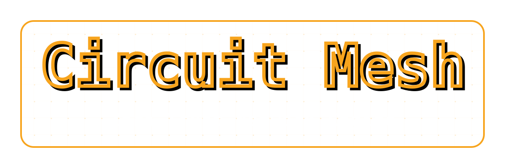

<!--
SPDX-FileCopyrightText: 2026 TSUKUMO Akito <tsukumoakito99@duck.com>
SPDX-License-Identifier: AGPL-3.0-or-later OR LicenseRef-circuit-mesh-Commercial
-->

<p align="center">
  
</p>

# Circuit Mesh (ゼロトラスト・ネットワークエンジン)

**安全なDNS出口通信とアイデンティティ回転を実現するゼロトラスト・ネットワークエンジン。**

`Circuit Mesh` は、Zig で記述された高性能なネットワーク・バリア兼プロキシマネージャです。Linux Netlink (IPSet) を活用してネットワークアクセスを動的に制御し、自動化されたアイデンティティ回転および DoH/DoT フォールバック機構を備えた、隔離された Tor 回路に DNS 通信を強制します。

コアコマンドである `circuit-mesh` はゲートキーパーとして機能し、システムの出口通信を、信頼されたノードのみで構成される厳格に定義された境界内に限定します。

[English README available here](./README.md)

---

## 主な機能

- **動的ネットワーク・バリア**: Netlink を介した Linux IPSet の直接操作により、「ゼロトラスト」な境界線を維持します。認証された Tor ノードと指定された DNS アップストリームのみが通信を許可されます。
- **ハイブリッド DNS トンネリング**:
    - **DoT (DNS over TLS)**: Zig ネイティブ TLS 実装による、Tor 経由の高効率なトンネリング。
    - **DoH (DNS over HTTPS)**: ネイティブ TLS が制限された環境でも、OpenSSL/H2 (HTTP/2) エンジンによる確実なフォールバックを提供。
- **Tor アイデンティティの高度な制御**:
    - Tor バイナリおよびステートファイルから、Directory Authorities (DA) と Guard ノードを自動抽出。
    - トンネルごとの SOCKS5 認証情報の回転と、Tor ControlPort を介したシームレスな回路パージ。
- **成功駆動型の回転ロジック**: TTL の期限切れや連続した接続失敗をトリガーとする、ロジックに基づいたアイデンティティ切り替え。
- **効率的なメモリ管理**: Zig の手動メモリ管理とカスタムトラッキングアロケータにより、堅牢な環境で予測可能なリソース使用量を実現。

---

## システムアーキテクチャ

1. **ディスカバリ・フェーズ**: Tor バイナリとコンセンサスファイルをスキャンし、初期の「セーフ IP」リストを構築。
2. **Netlink バリア**: 検出された IP とカーネルの IPSet を同期し、ネットワークを実質的にロック。
3. **DNS サービス**: ローカルの UDP/TCP ポートで待機し、クエリを暗号化された DoT/DoH トンネルにカプセル化。
4. **ウォッチドッグ**: トンネルの健全性を監視し、SOCKS 認証情報を回転させて出口 IP の多様性を確保。

---

## 技術要件

- **Zig コンパイラ**: `0.15.2` (厳格に適用。0.16.0 への移行を予定)。
- **Linux カーネル**: `IPSet` および `Netlink` のサポート。
- **依存関係**:
    - `OpenSSL`: HTTP/2 (DoH) サポートに必要。
    - `scdoc`: マニュアル（man ページ）の生成に必要。
    - `Tor`: `ControlPort` と `CookieAuthentication` が有効であること。

---

## インストール

### Arch Linux (AUR 経由)

Arch Linux ユーザーは、AUR (Arch User Repository) から `circuit-mesh` をインストールできます。これは、依存関係や systemd ユニットの統合が Arch の標準に従って自動的に処理されるため、推奨される方法です。

```bash
# AUR ヘルパー（yay など）を使用した例
yay -S circuit-mesh
```

### その他の Linux ディストリビューション (ソースから)

その他のディストリビューションでは、提供されている Makefile を使用して手動でビルドおよびインストールが可能です。

```bash
# 1. バイナリのビルド
make build

# 2. システムへのインストール (/usr/bin, /etc など)
sudo make install

# 3. システムからのアンインストール
sudo make uninstall
```

---

## 実行方法

`circuit-mesh` コマンドは、Netlink バリアを操作するためにルート権限（または `CAP_NET_ADMIN`）を必要とします。

```bash
# バリア同期とトンネルヘルスの詳細なテレメトリを表示して実行
sudo circuit-mesh --debug

# 特定の設定ファイルのパスを指定して実行
sudo circuit-mesh --config /path/to/config.json
```

---

## 実装状況とロードマップ

| 機能 | ステータス | 説明 |
| :--- | :--- | :--- |
| **Netlink エンジン** | ✅ 安定 | IPv4/IPv6 対応の IPSet 操作。 |
| **Tor ディスカバリ** | ✅ 安定 | バイナリ/ステート/コンセンサスからの抽出。 |
| **DNS トンネル** | ✅ 安定 | DoT (Native) および DoH (OpenSSL/H2)。 |
| **アイデンティティ回転** | ✅ 安定 | 認証情報の回転と回路のパージ。 |
| **Zig 0.16.0 対応** | 🛠️ 計画中 | 最新コンパイラへの移行とリファクタリング。 |
| **メールプロキシ** | 🛠️ 計画中 | IMAP/SMTP の隔離されたプロキシ。 |
| **汎用プロキシ** | 🛠️ 計画中 | I2P/VPN 等のグループ・チェーン対応。 |

---

## ドキュメント

- **MANUAL_ja.md**: 詳細な JSON 設定スキーマと回転ロジックの解説。
- **man circuit-mesh(1)**: 標準 Unix マニュアルページ（英語/日本語）。
- **COMMERCIAL.md**: 法人向け統合のためのライセンス条項。

---

## ライセンス

以下のデュアルライセンスの下で提供されています：

- **GNU Affero General Public License v3.0 or later (AGPL-3.0-or-later)**
- **コマーシャル・ライセンス** (詳細は `doc/COMMERCIAL.md` を参照)

---
**開発者ノート**: 本プロジェクトは現在実験的なベータ版です。高い可用性が求められる本番環境での使用には注意してください。
